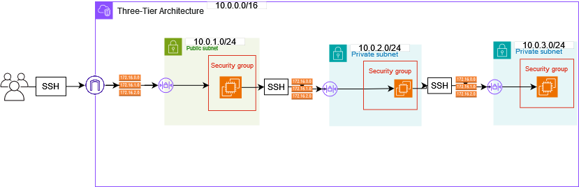

# Three-Tier AWS Architecture with Terraform and GitHub Actions

Project Overview
This project implements a secure three-tier architecture in AWS using Terraform as Infrastructure as Code (IaC) and GitHub Actions for CI/CD pipeline automation. The architecture consists of one VPC with three subnets (1 public, 2 private), each containing an EC2 instance with specific security configurations.
In the public subnet we will have the only EC2 instance with public access, via ssh and key pairs, while the other 2 private instances are accessible only from the public ec2.

Architecture Components
- 1 VPC
- 3 Subnets (1 Public, 2 Private)
- 3 Network ACLs (one per subnet)
- 3 Security Groups (one per subnet)
- 3 Route Tables (one per subnet)
- 3 EC2 instances (one per subnet)
- SSH access configuration
- Key pair authentication

Below the architecture diagram

